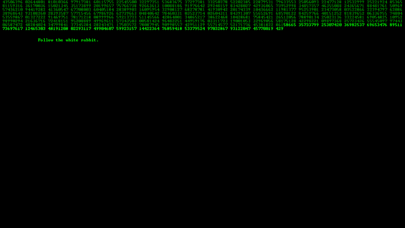

# MatrixDigitalRain (DLL)



## Description

This console application emulates matrix digital rain in the console window and various other effects. The application is a fan remake of the matrix digital rain effect from [The Matrix](https://en.wikipedia.org/wiki/The_Matrix).

## API

### Matrix.Builder Class ([fluent interface](https://en.wikipedia.org/wiki/Fluent_interface))

Methods               | Parameters             | Description
:-------------------- | :--------------------: |:--------------------------------
`SetSkipIntro`        | `bool` skipIntro       | **True** - skip the introduction (run only the matrix rain). **False** (default value) - don't skip the introduction.
`SetRandomColor`      | `bool` randomColor     | **True** - run a multicolored matrix rain. **False** (default value)Run the green matrix rain.
`SetShowQuoteAfter`   | `int` showQuoteAfter   | Set the frequency of quotes during the matrix rain (default value - 290).
`SetResetMatrixAfter` | `int` resetMatrixAfter | Set the frequency of reset the matrix rain (default value - 300).
`SetTextASCII`         | `string[,]` textASCII  | Set your ASCII-text for the introduction.

### Matrix Class

Methods            | Description
:----------------- | :----------------------------------------------------------
`RunFullVersion`   | Run the **RunMatrixRain** and **RunMatrixColumns** modules.
`RunMatrixRain`    | Run only the **RunMatrixRain** module.
`RunMatrixColumns` | Run only the **RunMatrixColumns** module.

## How To Use

### **Step 1**

Add this project to any of your projects, using the **Solution Explorer -> Add -> Existing Project** by right-clicking on the **Solution Explorer**.

or

Build this project, using the **Solution Explorer -> Build Solution** by right-clicking on the **Solution Explorer**. Copy the created **MatrixDigitalRain.dll** file to the folder of your project, where the executable file (.exe) is located. Then add reference to **MatrixDigitalRain.dll** file, using the **Reference -> Add Reference** by right-clicking on the **Reference** in **Solution Explorer**.

### **Step 2**

Use the methods in the **Matrix.Builder** ([fluent interface](https://en.wikipedia.org/wiki/Fluent_interface)) to configure and build:

```C#
IMatrix matrix = new Matrix.Builder()
                    .SetRandomColor(true) // run a multicolored matrix rain
                    .Build();
```

### **Step 3**

Use the methods in the **Matrix** to run:

```C#
matrix.RunFullVersion();
```

or

```C#
matrix.RunMatrixRain();
```

or

```C#
matrix.RunMatrixColumns();
```

## Keyboard shortcut

Keys          | Description
:------------ | :----------------------------------------------------------
**F1**        | Press the key to display help.
**Escape**    | Press the key to clear console.
**1..6**      | Press the number key to change the color of the matrix rain.
**UpArrow**   | Press the key to slow down the matrix rain.
**DownArrow** | Press the key to speed up the matrix rain.

## Simple example

```C#
IMatrix matrix = new Matrix.Builder()
                    .SetRandomColor(true)
                    .Build();

matrix.RunFullVersion();
```

## Licence

[MIT License](https://github.com/artgl42/MatrixDigitalRain/blob/master/LICENSE) Copyright (c) 2020 Artem Glushkov
